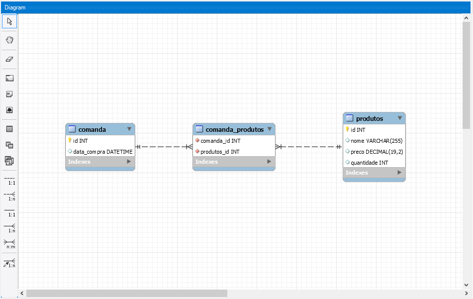
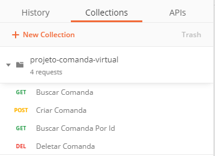

# Projeto Comanda Virtual FIAP - Turma 35SCJ

## Pré-requisitos para execução da aplicação de transação

Tecnologias necessárias:

- Back-end

  1 - Para executar o projeto é necessário ter o JRE 8 ou JDK 8 instalado.
  
  2 - Utilizar uma IDE para execução. (Eclipse é recomendado)
  
  3 - Necessário ter MySQL instalado.
  
- Front-end

  1 - Para executar o projeto é necessário ter o gerenciador de pacotes npm instalado
  
---

## Componentes utilizados
 Back-end
  - Spring Web
  - Spring Data JPA
  - MySQL
  - Swagger (Documentação)
  
 Front-end
  - React JS
  
 Contêiner
  - Docker
  - Docker Compose
  
----

## Instalação e execução do projeto


```sh
$ git clone https://github.com/camisbressan/fiap-microservice-comanda-virtual.git
```

- Back-end
Para iniciar a aplicação, ir no pacote `br.com.fiap.microservice.comanda` existe um arquivo chamado `ComandaApplication.java`. Clique com o botão direito e execute em Run.

- Front-end
Ao abrir o projeto, entre na pasta `client` pelo terminal e execute `npm install`

----
## Modelo de Dados



----

## Funcionalidades Postman



----

## Documentação Swagger


----

## Testes


----


### Imagem apenas do Front-end

```bash
# Baixando a imagem
$ docker pull carolldsk/client

# Rodando imagem
$ docker run --name client -it -p 3000:3001 -d carolldsk/client

```

### Imagem apenas do Back-end

```bash

# Baixando a imagem
$ docker pull carolldsk/comanda

# Rodando imagem
$ docker run --name comanda-it -p 8080:8080 -d carolldsk/comanda

```


### Inicialização do projeto com Docker Compose

```bash
# Clone deste repositório
$ git clone https://github.com/carolldsk/ecoleta.git

# Permissão do maven
$ chmod +x mvnw

# Docker Compose para definir como será o ambiente da aplicação
$ docker-compose up -d

```

### Em caso de erro: no space left on device

```bash
# Aumentando o espaço da VM
$ cd ~/environment/
$ rm -rf config-ubuntu
$ git clone https://github.com/tonanuvem/config-ubuntu.git
$ chmod +x resize.sh
$ ./resize.sh

# Removendo de uma vez todas as imagens
docker stop $(docker ps -a -q)
$ docker system prune --all --force --volumes
```
